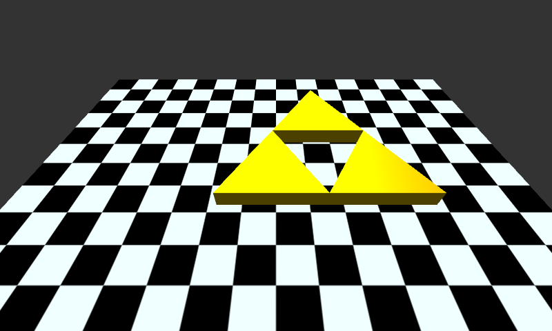

# Triforces OpenGL Demo
A 3D demo demonstrating some animation and Blinn-Phong shading.


## Installation
To install the demo, for the source tree and run
```bash
cargo build --release
```
to build it, and the
```bash
cargo install
```
to install it. If you want to uninstall it, enter
```bash
cargo uninstall triforces-demo
```

## Running From Source
Fork the demo and enter
```bash
cargo build --release
```
to build it, and then
```bash
cargo run
```
to run it from the source tree.

## Dependencies
### Linux
This program requires `Rust 2018 Edition (>= 1.30.0)` and `OpenGL (>= 4.60)` to run.
### Microsoft Windows
This program requires `Rust 2018 Edition (>= 1.30.0)` and `OpenGL (>= 3.30)` to run.
### Apple MacOS
This program requires a recent version of `Rust (>= 1.30.0)` and `(OpenGL >= 3.30)` to run. 
It runs on `macOS 10.9` through `macOS 10.13`. As of `macOS 10.14`, OpenGL is deprecated.

## Controls
The demo has the following control scheme.
* A -- Move camera left
* D -- Move camera right
* Q -- Move camera up
* E -- Move camera down
* W -- Move camera forward
* S -- Move camera backwards
* Left Arrow -- Yaw camera left
* Right Arrow -- Yaw camera right
* Up Key -- Pitch camera up
* Down Key -- Pitch camera down
* Z -- Roll camera left
* C -- Roll camera right
* Escape -- Close window and shut down program
* Backspace -- Reset the camera position and orientation to default.
